# MarketWorld — Full Production Architecture

> **Architecture status:** Target production architecture  
> **Recommended strategy:** Progressive refactoring into a modular monolith; do not destructively rewrite working modules without audit, migration, testing, and verification.

## Table of Contents

- [1. Architecture Overview](#1-architecture-overview)
- [2. Repository Structure](#2-repository-structure)
- [3. Architectural Layers](#3-architectural-layers)
- [4. Multi-Tenant Architecture](#4-multi-tenant-architecture)
- [5. RLS Architecture](#5-rls-architecture)
- [6. Authentication and Authorization](#6-authentication-and-authorization)
- [7. Subscription Architecture](#7-subscription-architecture)
- [8. Payment and Order Architecture](#8-payment-and-order-architecture)
- [9. Financial Architecture](#9-financial-architecture)
- [10. Support and Chat Architecture](#10-support-and-chat-architecture)
- [11. Notifications and Background Jobs](#11-notifications-and-background-jobs)
- [12. Storefront, Search and Media](#12-storefront-search-and-media)
- [13. Business Domains](#13-business-domains)
- [14. Database Relationship Overview](#14-database-relationship-overview)
- [15. API, Errors and Observability](#15-api-errors-and-observability)
- [16. Security Architecture](#16-security-architecture)
- [17. CI/CD, Environments and Deployment](#17-cicd-environments-and-deployment)
- [18. Scaling Strategy](#18-scaling-strategy)
- [19. Repository Principle](#19-repository-principle)
- [20. Final Architecture](#20-final-architecture)

---

## 1. Architecture Overview

MarketWorld is a multi-tenant marketplace platform organized around:

- **Frontend:** Vue 3 + Pinia
- **Backend:** Express / Node.js
- **Database:** PostgreSQL with Row-Level Security (RLS)
- **Cache and jobs:** Redis-backed queues and workers
- **Real-time:** Socket.io
- **Payments:** Paystack
- **Media:** Cloudinary / object storage
- **Email:** SendGrid / SMTP
- **Operations:** CI/CD, monitoring, audit logs, backups, and recovery

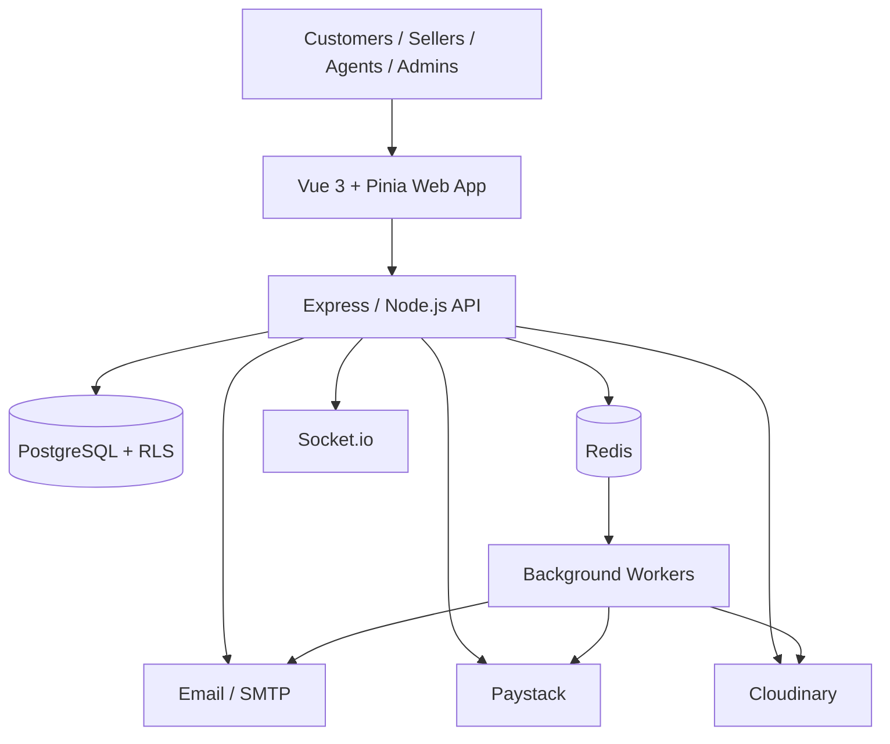

---

## 2. Repository Structure

```text
MarketWorld/
├── apps/
│   ├── web/                              # Main Vue 3 application
│   │   ├── public/
│   │   │   ├── favicon.ico
│   │   │   ├── robots.txt
│   │   │   ├── manifest.webmanifest
│   │   │   └── icons/
│   │   └── src/
│   │       ├── app/
│   │       │   ├── App.vue
│   │       │   ├── main.js
│   │       │   ├── providers/
│   │       │   ├── layouts/
│   │       │   └── config/
│   │       ├── assets/
│   │       │   ├── images/
│   │       │   ├── icons/
│   │       │   └── fonts/
│   │       ├── components/
│   │       │   ├── common/
│   │       │   ├── forms/
│   │       │   ├── tables/
│   │       │   ├── modals/
│   │       │   ├── notifications/
│   │       │   ├── charts/
│   │       │   ├── chat/
│   │       │   ├── products/
│   │       │   ├── orders/
│   │       │   ├── support/
│   │       │   └── storefront/
│   │       ├── layouts/
│   │       │   ├── PublicLayout.vue
│   │       │   ├── AuthLayout.vue
│   │       │   ├── CustomerLayout.vue
│   │       │   ├── SellerLayout.vue
│   │       │   ├── AgentLayout.vue
│   │       │   ├── AdminLayout.vue
│   │       │   └── SuperAdminLayout.vue
│   │       ├── views/
│   │       │   ├── auth/
│   │       │   │   ├── Login.vue
│   │       │   │   ├── Register.vue
│   │       │   │   ├── ForgotPassword.vue
│   │       │   │   ├── ResetPassword.vue
│   │       │   │   ├── VerifyEmail.vue
│   │       │   │   └── OAuthCallback.vue
│   │       │   ├── storefront/
│   │       │   ├── customer/
│   │       │   ├── seller/
│   │       │   ├── agent/
│   │       │   ├── admin/
│   │       │   ├── super-admin/
│   │       │   └── legal/
│   │       ├── stores/
│   │       │   ├── auth.store.js
│   │       │   ├── cart.store.js
│   │       │   ├── seller.store.js
│   │       │   ├── customer.store.js
│   │       │   ├── subscription.store.js
│   │       │   ├── notification.store.js
│   │       │   ├── support.store.js
│   │       │   └── chat.store.js
│   │       ├── services/
│   │       ├── router/
│   │       │   ├── index.js
│   │       │   ├── guards/
│   │       │   └── routes/
│   │       ├── composables/
│   │       ├── utils/
│   │       ├── constants/
│   │       ├── validators/
│   │       └── types/
│   └── api/                              # Optional API gateway / BFF
│
├── backend/
│   └── src/
│       ├── server.js
│       ├── app.js
│       ├── config/
│       ├── controllers/
│       ├── services/
│       │   ├── auth/
│       │   ├── marketplace/
│       │   ├── payments/
│       │   ├── subscriptions/
│       │   ├── communication/
│       │   ├── notifications/
│       │   ├── logistics/
│       │   ├── finance/
│       │   ├── analytics/
│       │   ├── security/
│       │   ├── media/
│       │   ├── sellers/
│       │   └── reports/
│       ├── middleware/
│       ├── routes/
│       ├── db/
│       │   ├── migrations/
│       │   ├── seeds/
│       │   └── views/
│       ├── models/
│       ├── validators/
│       ├── policies/
│       ├── sockets/
│       ├── jobs/
│       │   ├── queues/
│       │   └── workers/
│       ├── events/
│       ├── integrations/
│       ├── utils/
│       └── docs/
│
├── database/
│   ├── migrations/
│   │   ├── 001_extensions.sql
│   │   ├── 002_users.sql
│   │   ├── 003_sellers.sql
│   │   ├── 004_customers.sql
│   │   ├── ...
│   │   ├── 043_rls_policies.sql
│   │   └── 044_indexes.sql
│   ├── seeds/
│   └── functions/
│
├── packages/
│   ├── shared/
│   ├── eslint-config/
│   ├── prettier-config/
│   └── api-client/
│
├── tests/
│   ├── unit/
│   ├── integration/
│   ├── security/
│   ├── e2e/
│   └── fixtures/
│
├── infrastructure/
│   ├── docker/
│   ├── nginx/
│   ├── redis/
│   ├── postgres/
│   ├── monitoring/
│   └── deployment/
│
├── .github/workflows/
├── docs/
│   ├── architecture/
│   ├── api/
│   ├── database/
│   ├── deployment/
│   ├── security/
│   └── runbooks/
├── scripts/
├── .env.example
├── .gitignore
├── docker-compose.yml
├── package.json
├── pnpm-workspace.yaml
├── README.md
├── SECURITY.md
├── CONTRIBUTING.md
├── CHANGELOG.md
└── LICENSE
```

---

## 3. Architectural Layers

The backend dependency direction is:

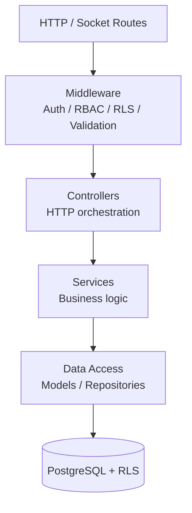

A controller should **not** contain large amounts of business logic.

Typical request flow:

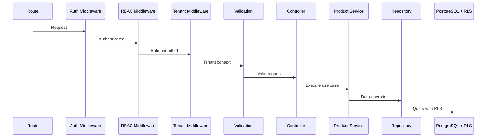

---

## 4. Multi-Tenant Architecture

The hierarchy is:

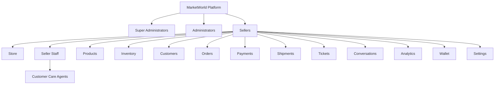

Every seller-owned record should ultimately be traceable to `seller_id`. Where appropriate, customer-owned records should additionally contain `customer_id`.

---

## 5. RLS Architecture

The application establishes tenant context for every authenticated database transaction.

```sql
SET LOCAL app.current_user_id = '...';
SET LOCAL app.current_seller_id = '...';
SET LOCAL app.current_role = '...';
```

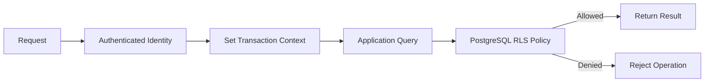

Conceptually, seller access checks enforce:

```text
seller_id = current_seller_id
```

Customer resources additionally verify the relevant customer identity. Administrative access should be explicitly defined rather than relying on a blanket unrestricted policy.

---

## 6. Authentication and Authorization

### Authentication

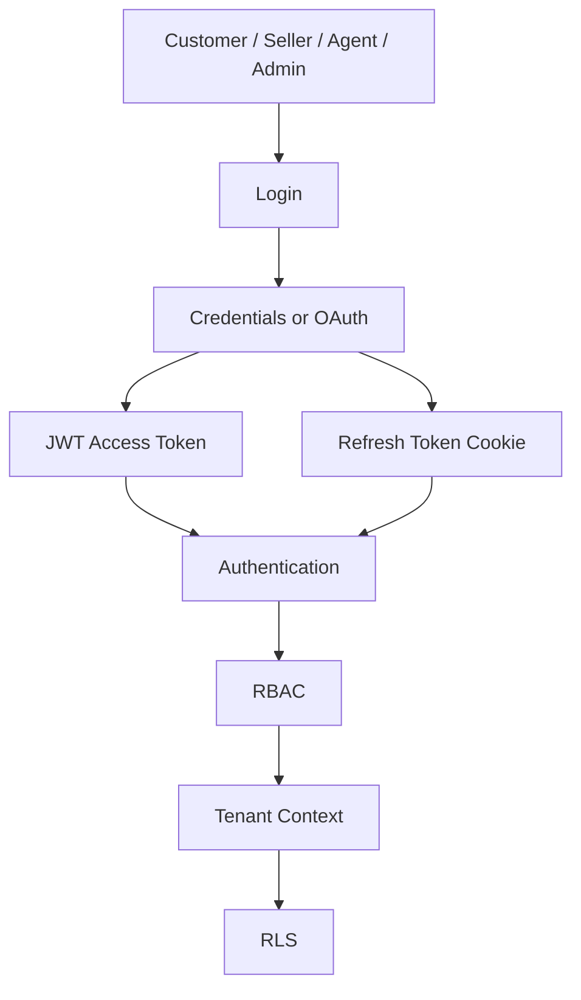

Supported capabilities include:

- Email/password
- Google OAuth
- Email verification
- Password reset
- Refresh tokens
- Logout
- Token revocation
- Rate limiting
- Suspicious login detection

### Authorization

Authorization should combine:

**RBAC + resource ownership + tenant isolation + subscription entitlement + RLS**

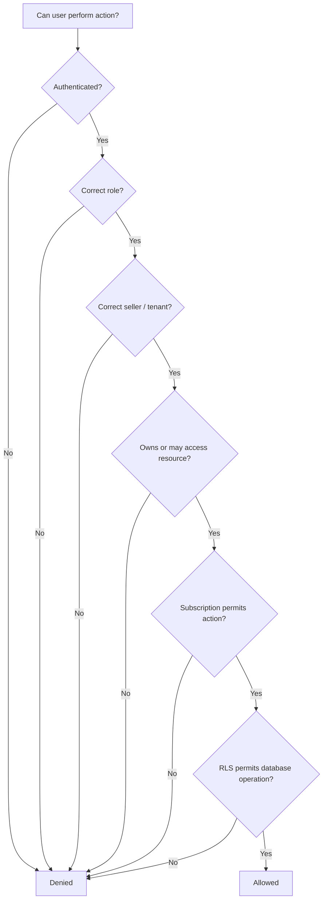

All relevant checks must happen server-side.

---

## 7. Subscription Architecture

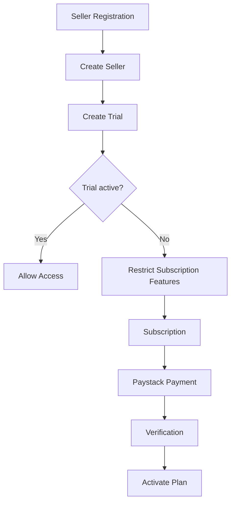

Subscription state should be calculated by backend services rather than trusting frontend state.

---

## 8. Payment and Order Architecture

### Payment Flow

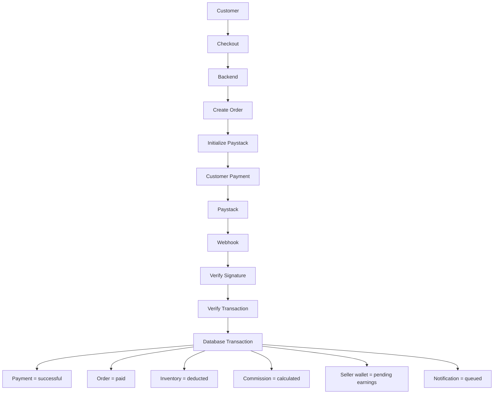

The frontend must never be the final authority for successful payment.

### Order Lifecycle

```mermaid
flowchart LR
    Cart --> Checkout --> Price[Price Validation]
    Price --> Tax[Tax Calculation]
    Tax --> Shipping[Shipping Calculation]
    Shipping --> Discount[Discount Validation]
    Discount --> Create[Order Creation]
    Create --> Payment
    Payment --> Confirm[Payment Confirmation]
    Confirm --> Inventory[Inventory Transaction]
    Inventory --> Processing[Seller Processing]
    Processing --> Shipment
    Shipment --> Delivery
    Delivery --> Review[Review / Return]
```

---

## 9. Financial Architecture

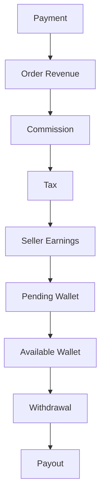

Every financial movement should create an immutable transaction record.

---

## 10. Support and Chat Architecture

### Support

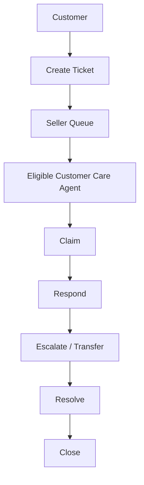

The customer cannot choose an arbitrary seller agent. The backend derives eligible agents from the seller relationship.

### Secure Socket Flow

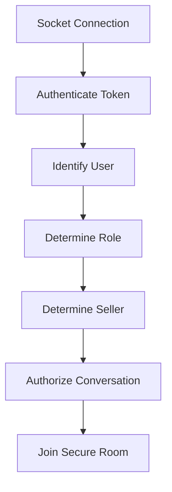

Example logical rooms:

```text
conversation:{conversationId}
seller:{sellerId}:support
user:{userId}:notifications
```

The server must verify ownership and authorization before a user joins any secure room.

---

## 11. Notifications and Background Jobs

### Event-Driven Notifications

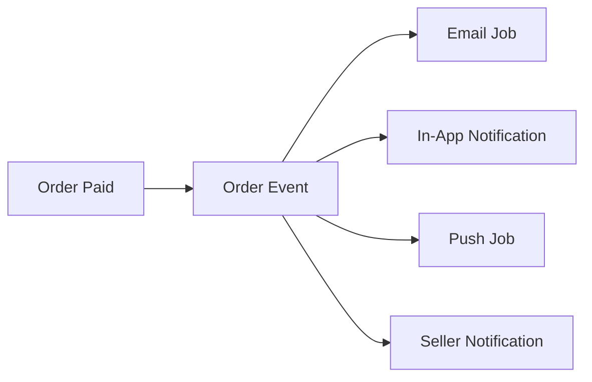

### Background Jobs

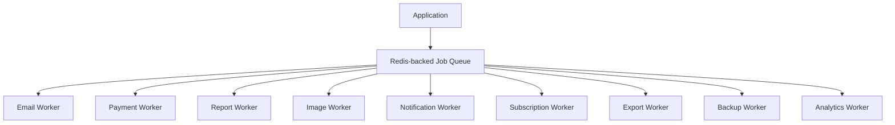

Jobs must carry tenant context safely.

---

## 12. Storefront, Search and Media

### Storefront Resolution

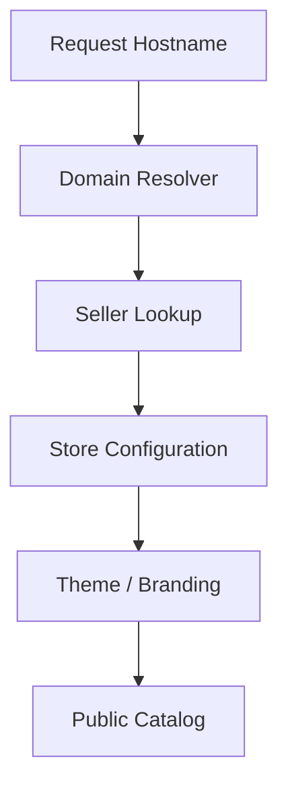

Possible hosts include:

```text
seller.marketworld.com
www.sellerbusiness.com
```

Private seller data must never be exposed through the storefront resolver.

### Search

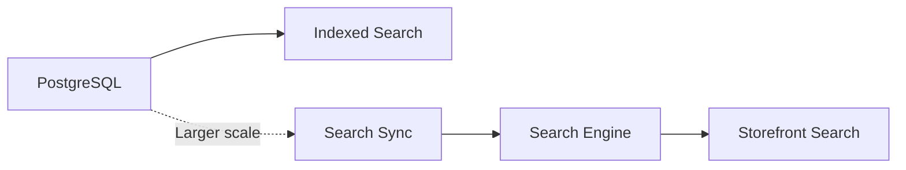

Search indexes must not contain private customer information.

### Media

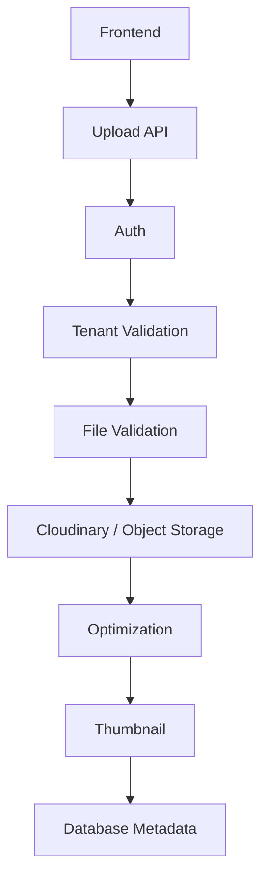

Never trust a client-provided `seller_id` to determine file ownership.

---

## 13. Business Domains

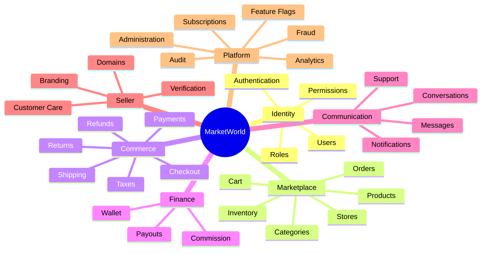

---

## 14. Database Relationship Overview

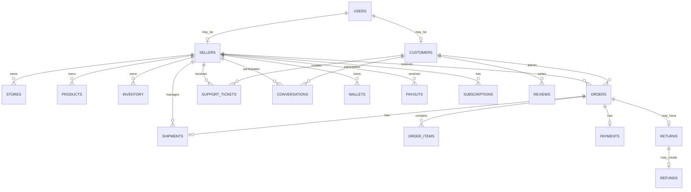

Orders conceptually connect:

- Customer
- Seller
- Order items
- Payment
- Shipment
- Tax
- Commission
- Return
- Refund

---

## 15. API, Errors and Observability

### Versioned API

```text
/api/v1/auth
/api/v1/users
/api/v1/sellers
/api/v1/customers
/api/v1/products
/api/v1/orders
/api/v1/payments
/api/v1/subscriptions
/api/v1/shipping
/api/v1/returns
/api/v1/support
/api/v1/messages
/api/v1/notifications
/api/v1/analytics
/api/v1/admin
/api/v1/super-admin
/api/v1/webhooks
```

### Standard Response

Successful:

```json
{
  "success": true,
  "data": {},
  "message": "Operation completed successfully"
}
```

Error:

```json
{
  "success": false,
  "error": {
    "code": "RESOURCE_NOT_FOUND",
    "message": "The requested resource was not found"
  },
  "requestId": "..."
}
```

Do not expose stack traces or raw database errors in production.

### Error Flow

```mermaid
flowchart LR
    Controller --> ServiceError[Service Error]
    ServiceError --> AppError
    AppError --> Middleware[Error Middleware]
    Middleware --> Logger
    Logger --> Response[Sanitized API Response]
```

### Observability

```mermaid
flowchart TB
    Application --> Logs[Structured Logs]
    Application --> Metrics
    Application --> Traces
    Application --> Errors[Error Monitoring]
    Application --> Audit[Audit Logs]
    Logs --> Monitoring[Monitoring Stack]
    Metrics --> Monitoring
    Traces --> Monitoring
    Errors --> Monitoring
    Audit --> Monitoring
```

Every request should have a request/correlation ID.

---

## 16. Security Architecture

```mermaid
flowchart TB
    Internet --> HTTPS
    HTTPS --> Proxy[Reverse Proxy]
    Proxy --> CORS
    CORS --> Helmet
    Helmet --> Rate[Rate Limiting]
    Rate --> Auth[Authentication]
    Auth --> RBAC
    RBAC --> Tenant[Tenant Context]
    Tenant --> Ownership
    Ownership --> Validation
    Validation --> RLS
    RLS --> DB[(PostgreSQL)]
```

No single security layer should be considered sufficient.

---

## 17. CI/CD, Environments and Deployment

### CI/CD Pipeline

```mermaid
flowchart LR
    GitHub --> PR[Pull Request]
    PR --> Install
    Install --> Lint
    Lint --> Unit[Unit Tests]
    Unit --> Integration[Integration Tests]
    Integration --> Security[Security Scan]
    Security --> Build
    Build --> Migration[Migration Validation]
    Migration --> Staging
    Staging --> E2E[E2E Tests]
    E2E --> Approval[Production Approval]
    Approval --> Production[Production Deployment]
```

### Environments

```mermaid
flowchart LR
    Development --> Testing --> Staging --> Production
```

Recommended environment files:

```text
.env.example
.env.development
.env.test
.env.staging
.env.production
```

Actual secrets should remain outside Git.

### Production Deployment

```mermaid
flowchart TB
    Internet --> CDN[CDN / WAF]
    CDN --> LB[Load Balancer]
    LB --> Frontend[Frontend CDN]
    LB --> API[API Servers]

    API --> DB[(PostgreSQL)]
    API --> Redis[(Redis)]
    Redis --> Workers[Background Workers]

    API --> Paystack[Paystack]
    API --> Cloudinary[Cloudinary]
    API --> Email[Email / SMS]
    Workers --> Paystack
    Workers --> Cloudinary
    Workers --> Email
```

---

## 18. Scaling Strategy

Start as a **modular monolith**.

```mermaid
flowchart TB
    Core[MarketWorld Backend]
    Core --> Marketplace
    Core --> Communication
    Core --> Finance
    Marketplace --> DB[(Database)]
    Communication --> DB
    Finance --> DB
```

As traffic and operational needs increase, selected domains can later be extracted:

```mermaid
flowchart TB
    Core[MarketWorld Core]
    Core --> Payment[Payment Service]
    Core --> Notification[Notification Service]
    Core --> Search[Search Service]
    Core --> Analytics[Analytics Service]
    Core --> Media[Media Service]
```

Avoid premature microservice complexity.

---

## 19. Repository Principle

> **Do not force the existing project into this structure by deleting and recreating everything.**

Use progressive architecture mapping:

```mermaid
flowchart TB
    Current[Current MarketWorld Codebase]
    Current --> Audit[Complete Audit]
    Audit --> Mapping[Architecture Mapping]
    Mapping --> Duplicates[Identify Duplicates]
    Duplicates --> Missing[Identify Missing Domains]
    Missing --> Refactor[Refactor Carefully]
    Refactor --> Migrate[Migrate Existing Modules]
    Migrate --> Test
    Test --> Verify
```

Existing working files should remain working while the architecture is progressively cleaned up.

---

## 20. Final Architecture

```mermaid
flowchart TB
    MW[MARKETWORLD]

    MW --> FE[FRONTEND]
    MW --> BE[BACKEND]
    MW --> DB[(DATABASE)]

    FE --> Roles[Customer / Seller / Customer Care / Admin / Super Admin]

    BE --> REST[REST API]
    BE --> Socket[Socket.io]
    REST --> Middleware
    Socket --> Middleware
    Middleware --> Controllers
    Controllers --> Services

    Services --> Marketplace
    Services --> Finance
    Services --> Communication
    Services --> Data[Data Access]
    Data --> DB
    DB --> RLS[RLS Policies]

    MW --> Paystack[Paystack]
    MW --> Redis[Redis]
    MW --> Cloudinary[Cloudinary]

    Redis --> Jobs[Background Jobs]
    Paystack --> Payments[Payments]
    Cloudinary --> Media[Media]

    Jobs --> Notifications
    Notifications --> Email
    Notifications --> SMS
    Notifications --> Push

    MW --> Operations
    Operations --> CICD[CI/CD]
    Operations --> Monitoring
    Operations --> Backups
    CICD --> GitHub
    Monitoring --> Logs[Logs / Metrics / Traces]
    Backups --> Recovery
```

---

# Key Architectural Decision

For the current MarketWorld project, the recommended foundation is:

> **Vue 3 + Pinia → Express/Node.js → PostgreSQL/RLS**

With supporting systems:

> **Redis → background jobs / cache / real-time scaling**  
> **Socket.io → live communication**  
> **Paystack → payments**  
> **Cloudinary → media**  
> **SendGrid/SMTP → email**  
> **CI/CD → automated verification and deployment**

This provides a serious production architecture while avoiding the maintenance burden of prematurely splitting the marketplace into many microservices.

The structure above is the **target architecture**. The existing codebase should be audited against it before restructuring, and destructive changes should remain confirmation-gated.
