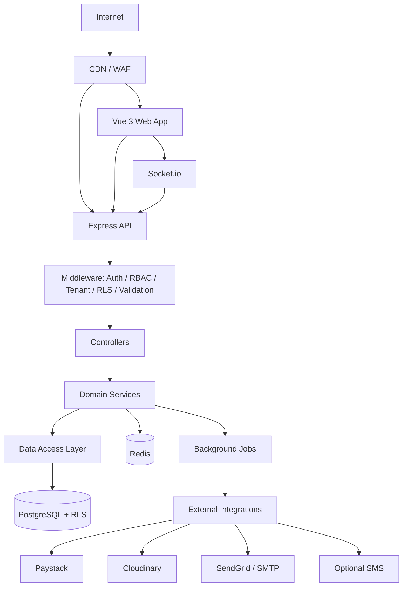
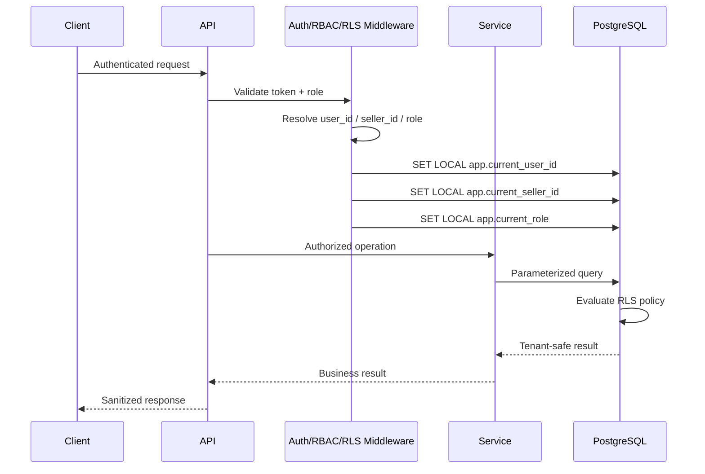
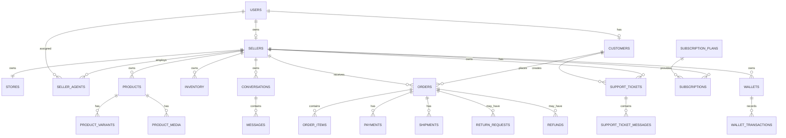
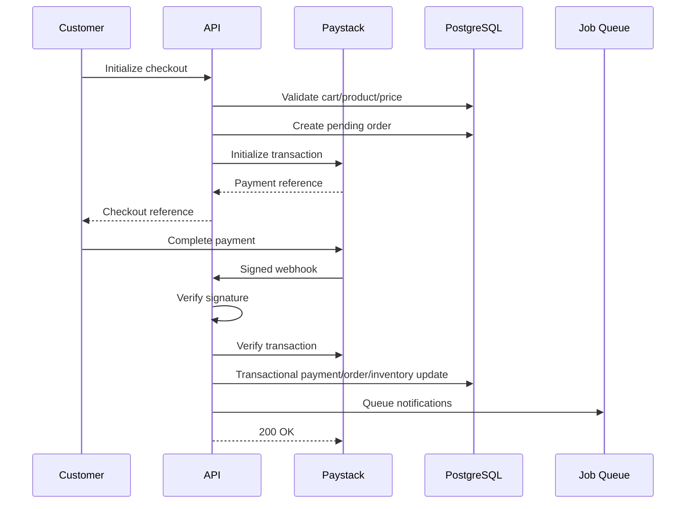
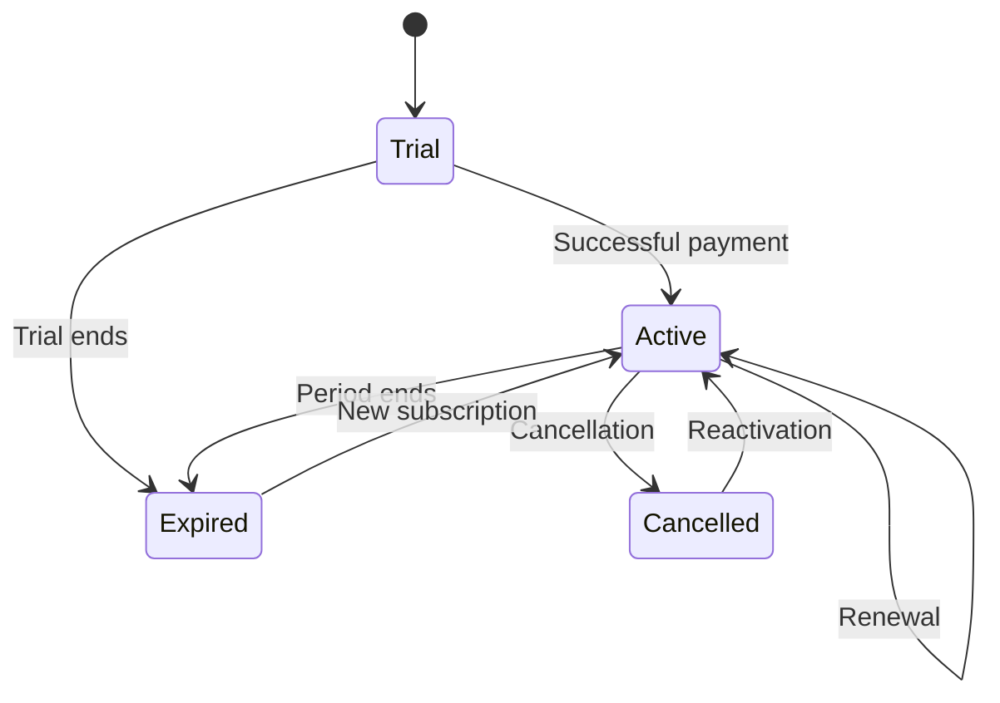
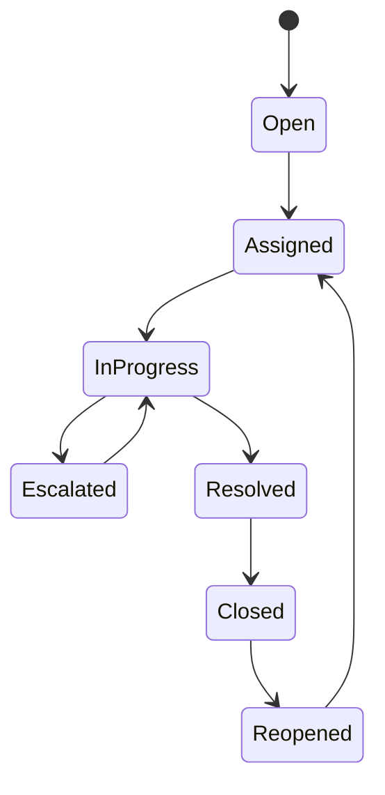

# MarketWorld Marketplace SaaS — Production Architecture

> Master architecture reference for the existing MarketWorld project. This document defines the target database schema, PostgreSQL RLS model, API architecture, Mermaid diagrams, security boundaries, and implementation conventions. **Do not recreate the existing application. Audit first, preserve working functionality, and make destructive changes only after explicit confirmation.**

## 1. Architecture Principles

- Modular monolith first; extract services only when scale requires it.
- Backend is the security boundary.
- PostgreSQL Row-Level Security (RLS) is mandatory for tenant-scoped data.
- Every seller-owned record is tenant-scoped through `seller_id`.
- Customer access is additionally constrained by `customer_id` and legitimate seller relationships.
- Never trust client-supplied seller IDs, roles, prices, payment status, or subscription status.
- Financial records are immutable/auditable.
- Payment webhooks are signature-verified and idempotent.
- Socket rooms are authorization-controlled.
- Background jobs carry safe tenant context and are idempotent.
- Public storefront data is separated from private seller/customer data.

## 2. System Architecture



## 3. Tenant Security Flow



# 4. Database Schema

The following is the logical production schema. Existing migrations should be compared against it before adding anything.

## Identity and Access

### users
- `id` UUID PK
- `email` unique
- `phone`
- `password_hash`
- `first_name`
- `last_name`
- `role`
- `status`
- `email_verified_at`
- `last_login_at`
- `created_at`
- `updated_at`

### refresh_tokens
- `id` UUID PK
- `user_id` FK users
- `token_hash`
- `expires_at`
- `revoked_at`
- `created_at`
- `last_used_at`

### roles
- `id` UUID PK
- `name` unique
- `description`

### permissions
- `id` UUID PK
- `key` unique
- `description`

### role_permissions
- `role_id` FK roles
- `permission_id` FK permissions
- composite PK

### user_permissions
- `user_id` FK users
- `permission_id` FK permissions
- composite PK

## Sellers and Stores

### sellers
- `id` UUID PK
- `owner_user_id` FK users
- `business_name`
- `legal_name`
- `status`
- `verification_status`
- `verified_at`
- `created_at`
- `updated_at`

### stores
- `id` UUID PK
- `seller_id` FK sellers UNIQUE
- `slug` unique
- `name`
- `description`
- `logo_url`
- `banner_url`
- `favicon_url`
- `theme_config` JSONB
- `font_config` JSONB
- `homepage_config` JSONB
- `seo_config` JSONB
- `social_links` JSONB
- `contact_info` JSONB
- `business_hours` JSONB
- `status`
- timestamps

### domains
- `id` UUID PK
- `seller_id` FK sellers
- `hostname` unique
- `type` (`subdomain`, `custom`)
- `verification_status`
- `verification_token`
- `verified_at`
- `is_primary`
- timestamps

## Seller Staff

### seller_agents
- `id` UUID PK
- `seller_id` FK sellers
- `user_id` FK users
- `status`
- `display_name`
- `created_at`
- `updated_at`

### agent_permissions
- `agent_id` FK seller_agents
- `permission_id` FK permissions
- composite PK

### agent_activity
- `id` UUID PK
- `seller_id`
- `agent_id`
- `action`
- `resource_type`
- `resource_id`
- `metadata` JSONB
- `created_at`

## Customers

### customers
- `id` UUID PK
- `user_id` FK users UNIQUE
- profile fields
- status
- timestamps

### seller_customers
Relationship proving that a customer has interacted/purchased with a seller.
- `seller_id` FK sellers
- `customer_id` FK customers
- `first_order_at`
- `last_order_at`
- `order_count`
- `lifetime_value`
- timestamps
- composite PK (`seller_id`, `customer_id`)

### customer_addresses
- `id` UUID PK
- `customer_id`
- address fields
- `is_default`
- timestamps

## Catalog

### categories
- `id` UUID PK
- `seller_id` nullable for platform categories
- `parent_id`
- `name`
- `slug`
- `description`
- `status`
- timestamps

### brands
- `id` UUID PK
- `seller_id`
- `name`
- `slug`
- timestamps

### products
- `id` UUID PK
- `seller_id`
- `category_id`
- `brand_id`
- `name`
- `slug`
- `sku`
- `description`
- `price`
- `compare_at_price`
- `discount`
- `currency`
- `status`
- `rating_average`
- `rating_count`
- `popularity_score`
- `seo_metadata` JSONB
- shipping metadata
- timestamps

### product_tags
- `product_id`
- `tag`
- composite PK

### product_variants
- `id` UUID PK
- `product_id`
- `sku`
- `name`
- `attributes` JSONB
- `price`
- `stock_quantity`
- `status`
- timestamps

### product_media
- `id` UUID PK
- `seller_id`
- `product_id`
- `url`
- `type`
- `public_id`
- `width`
- `height`
- `size_bytes`
- `sort_order`
- timestamps

## Inventory

### inventory
- `id` UUID PK
- `seller_id`
- `product_id`
- `variant_id` nullable
- `quantity`
- `reserved_quantity`
- `low_stock_threshold`
- timestamps

### inventory_movements
- `id` UUID PK
- `seller_id`
- `product_id`
- `variant_id`
- `type`
- `quantity`
- `reference_type`
- `reference_id`
- `performed_by`
- `metadata`
- `created_at`

## Commerce

### carts
- `id` UUID PK
- `customer_id`
- `seller_id`
- `status`
- timestamps

### cart_items
- `id` UUID PK
- `cart_id`
- `product_id`
- `variant_id`
- `quantity`
- `unit_price`
- timestamps

### orders
- `id` UUID PK
- `order_number` unique
- `seller_id`
- `customer_id`
- `status`
- `subtotal`
- `discount_total`
- `tax_total`
- `shipping_total`
- `grand_total`
- `currency`
- shipping address snapshot
- billing address snapshot
- timestamps

### order_items
- `id` UUID PK
- `order_id`
- `seller_id`
- `product_id`
- `variant_id`
- `product_name_snapshot`
- `sku_snapshot`
- `quantity`
- `unit_price`
- `tax_amount`
- `discount_amount`
- `line_total`

### order_status_history
- `id` UUID PK
- `order_id`
- `seller_id`
- `status`
- `changed_by`
- `notes`
- `created_at`

## Payments

### payments
- `id` UUID PK
- `seller_id`
- `customer_id`
- `order_id`
- `provider`
- `provider_reference`
- `amount`
- `currency`
- `status`
- `metadata`
- timestamps

### payment_events
- `id` UUID PK
- `provider`
- `event_id` unique
- `signature_verified`
- `payload_hash`
- `processed_at`
- `status`
- `error`
- created_at

## Shipping

### shipping_methods
- `id` UUID PK
- `seller_id`
- `name`
- `description`
- `carrier`
- `fee`
- `estimated_min_days`
- `estimated_max_days`
- `status`

### shipping_zones
- `id` UUID PK
- `seller_id`
- `name`
- `countries`
- `states`
- `cities`
- `postal_codes`
- timestamps

### shipments
- `id` UUID PK
- `seller_id`
- `order_id`
- `carrier`
- `tracking_number`
- `status`
- `estimated_delivery_at`
- `delivered_at`
- `delivery_proof_url`
- timestamps

### shipment_events
- `id` UUID PK
- `shipment_id`
- `seller_id`
- `status`
- `location`
- `description`
- `occurred_at`

## Tax

### tax_rules
- `id` UUID PK
- `seller_id` nullable
- `country`
- `region`
- `tax_type`
- `rate`
- `priority`
- `is_exempt`
- effective dates

### tax_exemptions
- `id` UUID PK
- `seller_id`
- `customer_id`
- `reason`
- `certificate_reference`
- `expires_at`

## Returns and Refunds

### return_requests
- `id` UUID PK
- `seller_id`
- `order_id`
- `customer_id`
- `status`
- `reason`
- `description`
- timestamps

### return_items
- `id` UUID PK
- `return_request_id`
- `order_item_id`
- `quantity`
- `condition`
- `inspection_result`

### refunds
- `id` UUID PK
- `seller_id`
- `customer_id`
- `order_id`
- `payment_id`
- `amount`
- `method`
- `provider_reference`
- `status`
- timestamps

## Finance

### commission_rules
- `id` UUID PK
- `scope_type`
- `seller_id` nullable
- `category_id` nullable
- `subscription_plan_id` nullable
- `percentage_rate`
- `flat_amount`
- `withdrawal_fee`
- `priority`
- effective dates

### commissions
- `id` UUID PK
- `seller_id`
- `order_id`
- `order_item_id`
- `rule_id`
- `amount`
- `rate_snapshot`
- created_at

### wallets
- `id` UUID PK
- `owner_type`
- `owner_id`
- `seller_id` nullable
- `currency`
- `available_balance`
- `pending_balance`
- timestamps

### wallet_transactions
- `id` UUID PK
- `wallet_id`
- `seller_id`
- `type`
- `amount`
- `balance_before`
- `balance_after`
- `reference_type`
- `reference_id`
- metadata
- created_at

### payout_requests
- `id` UUID PK
- `seller_id`
- `wallet_id`
- `amount`
- `fee`
- `net_amount`
- `status`
- `provider_reference`
- requested_at
- processed_at

## Reviews

### reviews
- `id` UUID PK
- `seller_id`
- `product_id`
- `customer_id`
- `order_id`
- `rating`
- `title`
- `body`
- `status`
- timestamps

### review_reports
- `id` UUID PK
- `seller_id`
- `review_id`
- `reported_by`
- `reason`
- `status`
- timestamps

## Support and Messaging

### support_tickets
- `id` UUID PK
- `seller_id`
- `customer_id`
- `assigned_agent_id`
- `category`
- `priority`
- `status`
- `subject`
- `description`
- timestamps

### support_ticket_messages
- `id` UUID PK
- `ticket_id`
- `seller_id`
- `sender_user_id`
- `body`
- `is_internal`
- timestamps

### support_ticket_attachments
- `id` UUID PK
- `ticket_id`
- `seller_id`
- `uploaded_by`
- `url`
- `storage_key`
- `mime_type`
- `size_bytes`
- timestamps

### conversations
- `id` UUID PK
- `seller_id`
- `customer_id`
- `type`
- `status`
- timestamps

### conversation_participants
- `conversation_id`
- `user_id`
- `seller_id`
- `role`
- timestamps

### messages
- `id` UUID PK
- `conversation_id`
- `seller_id`
- `sender_user_id`
- `body`
- `message_type`
- `delivery_status`
- `read_at`
- timestamps

### message_attachments
- `id` UUID PK
- `message_id`
- `seller_id`
- `url`
- `storage_key`
- metadata

## Notifications

### notifications
- `id` UUID PK
- `user_id`
- `seller_id` nullable
- `type`
- `title`
- `body`
- `data` JSONB
- `read_at`
- timestamps

### notification_preferences
- `id` UUID PK
- `user_id`
- `channel`
- `event_type`
- `enabled`

## Subscriptions

### subscription_plans
- `id` UUID PK
- `name`
- `description`
- `price`
- `currency`
- `billing_interval`
- `features` JSONB
- `commission_rate`
- `status`

### subscriptions
- `id` UUID PK
- `seller_id`
- `plan_id`
- `provider`
- `provider_reference`
- `status`
- `trial_started_at`
- `trial_ends_at`
- `current_period_start`
- `current_period_end`
- `cancel_at_period_end`
- timestamps

### subscription_events
- `id` UUID PK
- `seller_id`
- `subscription_id`
- `event_type`
- `provider_event_id`
- metadata
- created_at

## Verification

### seller_verifications
- `id` UUID PK
- `seller_id`
- `type`
- `status`
- `submitted_at`
- `reviewed_at`
- `reviewed_by`
- `decision_reason`

### verification_documents
- `id` UUID PK
- `seller_id`
- `verification_id`
- `document_type`
- secure storage reference
- metadata
- timestamps

## Fraud and Security

### fraud_events
- `id` UUID PK
- `user_id` nullable
- `seller_id` nullable
- `event_type`
- `risk_score`
- `ip_hash`
- `device_hash`
- metadata
- created_at

### audit_logs
- `id` UUID PK
- `actor_user_id`
- `seller_id` nullable
- `action`
- `resource_type`
- `resource_id`
- `ip_hash`
- `user_agent`
- metadata
- created_at

### impersonation_sessions
- `id` UUID PK
- `admin_user_id`
- `target_user_id`
- `target_seller_id`
- `started_at`
- `expires_at`
- `ended_at`
- `reason`

## Platform Configuration

### feature_flags
- `id` UUID PK
- `key` unique
- `enabled`
- `scope`
- metadata

### system_settings
- `key` PK
- `value` JSONB
- `is_sensitive`
- updated_by
- updated_at

## Jobs and Analytics

### background_jobs
- `id` UUID PK
- `queue`
- `job_type`
- `seller_id` nullable
- `payload`
- `status`
- `attempts`
- `available_at`
- `processed_at`
- `last_error`

### analytics_daily_seller
- `seller_id`
- `date`
- revenue
- orders
- customers
- conversion_rate
- returns
- profit
- inventory_metrics

### analytics_daily_platform
- `date`
- mrr
- arr
- active_sellers
- active_customers
- new_users
- churn
- platform_revenue

# 5. Core Database Relationships



# 6. RLS Policy Model

Tenant-scoped tables must have RLS enabled.

Typical policy classes:

```text
Seller-owned:
    current_seller_id = seller_id

Customer-owned:
    current_user_id = owner user OR permitted seller relationship

Agent-owned:
    current_seller_id = agent seller

Public storefront:
    public/active catalog only

Admin:
    explicit platform role policy

Super Admin:
    explicit elevated policy
```

RLS must be tested directly against PostgreSQL, not only through HTTP integration tests.

# 7. API Architecture

Base URL:

```text
/api/v1
```

## Authentication

```text
POST   /auth/register
POST   /auth/login
POST   /auth/refresh
POST   /auth/logout
POST   /auth/forgot-password
POST   /auth/reset-password
GET    /auth/verify-email
GET    /auth/google
GET    /auth/google/callback
```

## Users

```text
GET    /users/me
PATCH  /users/me
PATCH  /users/me/password
GET    /users/me/sessions
DELETE /users/me/sessions/:id
```

## Sellers

```text
GET    /sellers/me
PATCH  /sellers/me
GET    /sellers/me/dashboard
GET    /sellers/me/settings
PATCH  /sellers/me/settings
GET    /sellers/me/customers
GET    /sellers/me/customers/:customerId
GET    /sellers/me/analytics
```

## Storefront

```text
GET    /store/:slug
GET    /store/:slug/products
GET    /store/:slug/products/:productId
GET    /store/:slug/categories
GET    /store/:slug/reviews
GET    /store/:slug/seo
```

## Domains and Branding

```text
GET    /seller/store
PATCH  /seller/store
POST   /seller/store/logo
POST   /seller/store/banner
POST   /seller/domains
POST   /seller/domains/:id/verify
DELETE /seller/domains/:id
```

## Products

```text
GET    /seller/products
POST   /seller/products
GET    /seller/products/:id
PATCH  /seller/products/:id
DELETE /seller/products/:id
POST   /seller/products/:id/media
DELETE /seller/products/:id/media/:mediaId
POST   /seller/products/import
GET    /seller/products/export
```

## Inventory

```text
GET    /seller/inventory
GET    /seller/inventory/:productId
PATCH  /seller/inventory/:productId
GET    /seller/inventory/movements
```

## Cart

```text
GET    /cart
POST   /cart/items
PATCH  /cart/items/:id
DELETE /cart/items/:id
DELETE /cart
```

## Checkout

```text
POST   /checkout/validate
POST   /checkout/initialize
GET    /checkout/:reference
```

## Orders

```text
GET    /orders
POST   /orders
GET    /orders/:id
PATCH  /seller/orders/:id/status
GET    /seller/orders
GET    /seller/orders/:id
```

## Payments

```text
POST   /payments/initialize
GET    /payments/:reference
POST   /payments/:reference/verify
```

## Paystack Webhook

```text
POST   /webhooks/paystack
```

Webhook processing must verify the signature and enforce idempotency.

## Subscriptions

```text
GET    /seller/subscription
GET    /subscription/plans
POST   /seller/subscription/initialize
POST   /seller/subscription/cancel
POST   /seller/subscription/reactivate
```

## Shipping

```text
GET    /seller/shipping/methods
POST   /seller/shipping/methods
PATCH  /seller/shipping/methods/:id
DELETE /seller/shipping/methods/:id

GET    /seller/shipping/zones
POST   /seller/shipping/zones
PATCH  /seller/shipping/zones/:id
DELETE /seller/shipping/zones/:id

GET    /orders/:id/shipment
GET    /seller/shipments
PATCH  /seller/shipments/:id
GET    /shipments/:id/tracking
```

## Tax

```text
GET    /seller/taxes/rules
POST   /seller/taxes/rules
PATCH  /seller/taxes/rules/:id
DELETE /seller/taxes/rules/:id
GET    /seller/taxes/reports
```

## Returns

```text
POST   /orders/:id/returns
GET    /returns
GET    /returns/:id
POST   /returns/:id/approve
POST   /returns/:id/reject
POST   /returns/:id/inspect
POST   /returns/:id/complete
```

## Refunds

```text
POST   /orders/:id/refund-request
GET    /seller/refunds
POST   /seller/refunds/:id/approve
POST   /seller/refunds/:id/reject
POST   /seller/refunds/:id/process
```

## Wallet

```text
GET    /seller/wallet
GET    /seller/wallet/transactions
GET    /customer/wallet
GET    /customer/wallet/transactions
```

## Payouts

```text
GET    /seller/payouts
POST   /seller/payouts
GET    /seller/payouts/:id
```

## Commissions

```text
GET    /seller/commissions
GET    /admin/commission-rules
POST   /admin/commission-rules
PATCH  /admin/commission-rules/:id
DELETE /admin/commission-rules/:id
```

## Support

```text
GET    /support/tickets
POST   /support/tickets
GET    /support/tickets/:id
POST   /support/tickets/:id/replies
POST   /support/tickets/:id/close
POST   /support/tickets/:id/reopen
POST   /support/tickets/:id/assign
POST   /support/tickets/:id/escalate
POST   /support/tickets/:id/transfer
POST   /support/tickets/:id/internal-notes
```

## Seller Customer Care

```text
GET    /seller/agents
POST   /seller/agents
POST   /seller/agents/invite
PATCH  /seller/agents/:id
POST   /seller/agents/:id/activate
POST   /seller/agents/:id/deactivate
DELETE /seller/agents/:id
GET    /seller/agents/:id/activity
GET    /seller/agents/:id/performance
PATCH  /seller/agents/:id/permissions
```

## Messaging

```text
GET    /conversations
POST   /conversations
GET    /conversations/:id
GET    /conversations/:id/messages
POST   /conversations/:id/messages
POST   /conversations/:id/read
POST   /conversations/:id/attachments
```

## Notifications

```text
GET    /notifications
POST   /notifications/:id/read
POST   /notifications/read-all
GET    /notifications/preferences
PATCH  /notifications/preferences
```

## Reviews

```text
POST   /products/:productId/reviews
GET    /products/:productId/reviews
PATCH  /reviews/:id
DELETE /reviews/:id
POST   /reviews/:id/report
```

## Verification

```text
GET    /seller/verification
POST   /seller/verification
POST   /seller/verification/documents
GET    /admin/verifications
POST   /admin/verifications/:id/approve
POST   /admin/verifications/:id/reject
```

## Analytics

```text
GET    /seller/analytics/overview
GET    /seller/analytics/revenue
GET    /seller/analytics/products
GET    /seller/analytics/customers
GET    /seller/analytics/inventory
GET    /seller/analytics/forecast

GET    /admin/analytics/overview
GET    /admin/analytics/revenue
GET    /admin/analytics/subscriptions
GET    /admin/analytics/users
GET    /admin/analytics/sellers
```

## Fraud

```text
GET    /admin/fraud/events
GET    /admin/fraud/events/:id
PATCH  /admin/fraud/events/:id
```

## Admin

```text
GET    /admin/overview
GET    /admin/users
GET    /admin/sellers
GET    /admin/customers
GET    /admin/agents
GET    /admin/products
GET    /admin/orders
GET    /admin/payments
GET    /admin/subscriptions
GET    /admin/plans
GET    /admin/tickets
GET    /admin/reviews
GET    /admin/refunds
GET    /admin/audit-logs
GET    /admin/system-config
PATCH  /admin/system-config
```

## Super Admin

```text
GET    /super-admin/overview
GET    /super-admin/analytics
GET    /super-admin/system
GET    /super-admin/feature-flags
PATCH  /super-admin/feature-flags/:id

GET    /super-admin/commission-rules
POST   /super-admin/commission-rules
PATCH  /super-admin/commission-rules/:id
DELETE /super-admin/commission-rules/:id

POST   /super-admin/impersonation
POST   /super-admin/impersonation/:id/end
GET    /super-admin/impersonation
```

## Health

```text
GET /health
GET /health/live
GET /health/ready
```

# 8. API Authorization Matrix

| Area | Customer | Agent | Seller | Admin | Super Admin |
|---|---|---|---|---|---|
| Public storefront | Read | Read | Read | Read | Read |
| Own account | Full | Full | Full | Full | Full |
| Own orders | Own | Assigned seller scope | Own seller | Platform policy | Full |
| Products | Public | Seller scope | Own seller | Moderation | Full |
| Customers | Own | Assigned seller | Own seller | Platform policy | Full |
| Tickets | Own | Assigned seller | Own seller | Platform | Full |
| Messages | Eligible conversations | Assigned seller | Own seller | Policy-based | Full |
| Subscription | Own seller | No | Own seller | Monitor | Full |
| Wallet | Own | No | Own seller | Monitor | Full |
| Commission config | No | No | Read own impact | Manage if permitted | Full |
| System config | No | No | No | Limited | Full |
| Impersonation | No | No | No | No by default | Yes |

# 9. WebSocket Architecture

Events:

```text
connection
disconnect
presence:update
conversation:join
conversation:leave
message:send
message:delivered
message:read
typing:start
typing:stop
notification:new
ticket:update
```

Every event must verify:

1. authenticated user;
2. role;
3. seller relationship;
4. conversation ownership;
5. ticket assignment where applicable;
6. feature flag/subscription where applicable.

# 10. Background Job Queues

Recommended queues:

```text
email
notifications
sms
push
image-processing
exports
reports
subscriptions
payments
analytics
backups
fraud
```

Jobs must include:
- job ID
- type
- tenant/seller context where applicable
- safe payload
- retry count
- idempotency key
- timestamps
- error state

# 11. Security Checklist

- Parameterized SQL.
- PostgreSQL RLS.
- Strict CORS.
- Helmet.
- Rate limits.
- Password hashing.
- Secure refresh cookies.
- Token rotation/revocation.
- Input validation.
- File validation.
- Paystack signature verification.
- Payment idempotency.
- Audit logs.
- Tenant-aware sockets.
- Tenant-aware jobs.
- No secrets in frontend.
- No secrets in Git.
- No trust in client-side prices or roles.
- No direct access to private files.
- No cross-seller references without authorization.
- No internal support notes exposed to customers.

# 12. Transaction Boundaries

The following must be transactional where applicable:

```text
Payment confirmation
→ Order payment update
→ Inventory deduction
→ Commission creation
→ Wallet pending balance

Refund
→ Refund record
→ Wallet/payment adjustment
→ Inventory adjustment where appropriate

Payout
→ Wallet debit
→ Payout record

Subscription activation
→ Payment verification
→ Subscription state
→ Entitlement state
```

# 13. Production Readiness

The application is only considered production-ready after:

- migrations pass on a clean staging database;
- RLS tests pass;
- unit/integration/security/E2E tests pass;
- backend starts cleanly;
- frontend production build succeeds;
- no known console/runtime errors remain;
- Paystack webhook is verified and tested;
- email/media providers are tested;
- backup/restore has been exercised;
- monitoring is operational;
- environment validation succeeds;
- README/API/deployment documentation is current.

# 14. Non-Destructive Development Rule

Before deleting files, changing authentication, changing database schemas, altering payment/subscription behavior, or performing irreversible migrations:

**STOP and request explicit confirmation.**

Always audit the existing implementation first.


---

# MarketWorld API Architecture — Master Reference

## API Conventions

Base path: `/api/v1`

Authentication:
- Bearer access token.
- httpOnly refresh cookie.
- Server-side role, tenant, ownership and subscription checks.

Response shape:

```json
{
  "success": true,
  "data": {},
  "message": "Operation completed successfully",
  "requestId": "uuid"
}
```

Error shape:

```json
{
  "success": false,
  "error": {
    "code": "RESOURCE_NOT_FOUND",
    "message": "The requested resource was not found"
  },
  "requestId": "uuid"
}
```

## Endpoint Groups

### Auth
POST `/auth/register`
POST `/auth/login`
POST `/auth/refresh`
POST `/auth/logout`
POST `/auth/forgot-password`
POST `/auth/reset-password`
GET `/auth/verify-email`
GET `/auth/google`
GET `/auth/google/callback`

### Users
GET `/users/me`
PATCH `/users/me`
PATCH `/users/me/password`
GET `/users/me/sessions`
DELETE `/users/me/sessions/:id`

### Seller
GET `/sellers/me`
PATCH `/sellers/me`
GET `/sellers/me/dashboard`
GET `/sellers/me/customers`
GET `/sellers/me/customers/:customerId`
GET `/sellers/me/analytics`

### Storefront
GET `/store/:slug`
GET `/store/:slug/products`
GET `/store/:slug/products/:productId`
GET `/store/:slug/categories`
GET `/store/:slug/reviews`

### Store Branding / Domains
GET `/seller/store`
PATCH `/seller/store`
POST `/seller/store/logo`
POST `/seller/store/banner`
POST `/seller/domains`
POST `/seller/domains/:id/verify`
DELETE `/seller/domains/:id`

### Products
GET `/seller/products`
POST `/seller/products`
GET `/seller/products/:id`
PATCH `/seller/products/:id`
DELETE `/seller/products/:id`
POST `/seller/products/:id/media`
DELETE `/seller/products/:id/media/:mediaId`
POST `/seller/products/import`
GET `/seller/products/export`

### Inventory
GET `/seller/inventory`
GET `/seller/inventory/:productId`
PATCH `/seller/inventory/:productId`
GET `/seller/inventory/movements`

### Cart / Checkout
GET `/cart`
POST `/cart/items`
PATCH `/cart/items/:id`
DELETE `/cart/items/:id`
DELETE `/cart`
POST `/checkout/validate`
POST `/checkout/initialize`
GET `/checkout/:reference`

### Orders
GET `/orders`
POST `/orders`
GET `/orders/:id`
GET `/seller/orders`
GET `/seller/orders/:id`
PATCH `/seller/orders/:id/status`

### Payments
POST `/payments/initialize`
GET `/payments/:reference`
POST `/payments/:reference/verify`
POST `/webhooks/paystack`

### Subscriptions
GET `/subscription/plans`
GET `/seller/subscription`
POST `/seller/subscription/initialize`
POST `/seller/subscription/cancel`
POST `/seller/subscription/reactivate`

### Shipping
GET `/seller/shipping/methods`
POST `/seller/shipping/methods`
PATCH `/seller/shipping/methods/:id`
DELETE `/seller/shipping/methods/:id`
GET `/seller/shipping/zones`
POST `/seller/shipping/zones`
PATCH `/seller/shipping/zones/:id`
DELETE `/seller/shipping/zones/:id`
GET `/seller/shipments`
GET `/orders/:id/shipment`
PATCH `/seller/shipments/:id`
GET `/shipments/:id/tracking`

### Taxes
GET `/seller/taxes/rules`
POST `/seller/taxes/rules`
PATCH `/seller/taxes/rules/:id`
DELETE `/seller/taxes/rules/:id`
GET `/seller/taxes/reports`

### Returns / Refunds
POST `/orders/:id/returns`
GET `/returns`
GET `/returns/:id`
POST `/returns/:id/approve`
POST `/returns/:id/reject`
POST `/returns/:id/inspect`
POST `/returns/:id/complete`
POST `/orders/:id/refund-request`
GET `/seller/refunds`
POST `/seller/refunds/:id/approve`
POST `/seller/refunds/:id/reject`
POST `/seller/refunds/:id/process`

### Wallet / Payout
GET `/seller/wallet`
GET `/seller/wallet/transactions`
GET `/customer/wallet`
GET `/customer/wallet/transactions`
GET `/seller/payouts`
POST `/seller/payouts`
GET `/seller/payouts/:id`

### Commission
GET `/seller/commissions`
GET `/admin/commission-rules`
POST `/admin/commission-rules`
PATCH `/admin/commission-rules/:id`
DELETE `/admin/commission-rules/:id`

### Customer Care
GET `/seller/agents`
POST `/seller/agents`
POST `/seller/agents/invite`
PATCH `/seller/agents/:id`
POST `/seller/agents/:id/activate`
POST `/seller/agents/:id/deactivate`
DELETE `/seller/agents/:id`
GET `/seller/agents/:id/activity`
GET `/seller/agents/:id/performance`
PATCH `/seller/agents/:id/permissions`

### Support
GET `/support/tickets`
POST `/support/tickets`
GET `/support/tickets/:id`
POST `/support/tickets/:id/replies`
POST `/support/tickets/:id/close`
POST `/support/tickets/:id/reopen`
POST `/support/tickets/:id/assign`
POST `/support/tickets/:id/escalate`
POST `/support/tickets/:id/transfer`
POST `/support/tickets/:id/internal-notes`

### Messaging
GET `/conversations`
POST `/conversations`
GET `/conversations/:id`
GET `/conversations/:id/messages`
POST `/conversations/:id/messages`
POST `/conversations/:id/read`
POST `/conversations/:id/attachments`

### Notifications
GET `/notifications`
POST `/notifications/:id/read`
POST `/notifications/read-all`
GET `/notifications/preferences`
PATCH `/notifications/preferences`

### Reviews
POST `/products/:productId/reviews`
GET `/products/:productId/reviews`
PATCH `/reviews/:id`
DELETE `/reviews/:id`
POST `/reviews/:id/report`

### Verification
GET `/seller/verification`
POST `/seller/verification`
POST `/seller/verification/documents`
GET `/admin/verifications`
POST `/admin/verifications/:id/approve`
POST `/admin/verifications/:id/reject`

### Analytics
GET `/seller/analytics/overview`
GET `/seller/analytics/revenue`
GET `/seller/analytics/products`
GET `/seller/analytics/customers`
GET `/seller/analytics/inventory`
GET `/seller/analytics/forecast`
GET `/admin/analytics/overview`
GET `/admin/analytics/revenue`
GET `/admin/analytics/subscriptions`
GET `/admin/analytics/users`
GET `/admin/analytics/sellers`

### Fraud
GET `/admin/fraud/events`
GET `/admin/fraud/events/:id`
PATCH `/admin/fraud/events/:id`

### Admin
GET `/admin/overview`
GET `/admin/users`
GET `/admin/sellers`
GET `/admin/customers`
GET `/admin/agents`
GET `/admin/products`
GET `/admin/orders`
GET `/admin/payments`
GET `/admin/subscriptions`
GET `/admin/plans`
GET `/admin/tickets`
GET `/admin/reviews`
GET `/admin/refunds`
GET `/admin/audit-logs`
GET `/admin/system-config`
PATCH `/admin/system-config`

### Super Admin
GET `/super-admin/overview`
GET `/super-admin/analytics`
GET `/super-admin/system`
GET `/super-admin/feature-flags`
PATCH `/super-admin/feature-flags/:id`
GET `/super-admin/commission-rules`
POST `/super-admin/commission-rules`
PATCH `/super-admin/commission-rules/:id`
DELETE `/super-admin/commission-rules/:id`
POST `/super-admin/impersonation`
POST `/super-admin/impersonation/:id/end`
GET `/super-admin/impersonation`

### Health
GET `/health`
GET `/health/live`
GET `/health/ready`

## Authorization Pipeline

```mermaid
flowchart LR
    Request --> Auth[Authentication]
    Auth --> Role[RBAC]
    Role --> Tenant[Tenant Context]
    Tenant --> Ownership[Resource Ownership]
    Ownership --> Subscription[Subscription Entitlement]
    Subscription --> Validation[Input Validation]
    Validation --> RLS[PostgreSQL RLS]
    RLS --> Service[Business Service]
    Service --> Response[Sanitized Response]
```



## Checkout Flow



## Subscription Flow



## Support Flow



## API Security Requirements

Every protected endpoint must determine authorization from server-side identity and database state.

Never accept these from the client as authoritative:
- role
- seller_id
- customer_id
- ownership
- subscription status
- product price
- payment status
- commission
- wallet balance

Sensitive operations must be audited.

## Idempotency

Use idempotency keys for:
- payment initialization
- webhook processing
- refunds
- payouts
- wallet movements
- subscription activation
- inventory deduction where retried

## API Documentation

The canonical OpenAPI document should be maintained at:

```text
backend/src/docs/openapi.yaml
```

Every endpoint should document:
- authentication
- required role
- tenant scope
- parameters
- request body
- success response
- error responses
- rate limits where relevant
- webhook signature requirements where relevant
